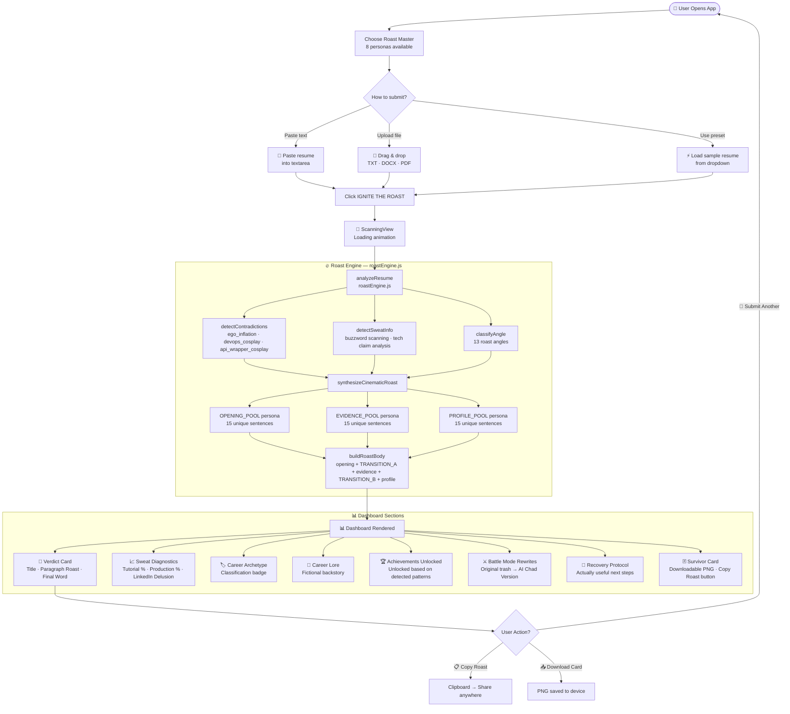

<p align="center">
  
  
  
  
  
</p>

<h1 align="center">🔥 AI Resume Roaster</h1>

<p align="center">
  <strong>Drop your CV. Choose your executioner. Watch it burn.</strong><br/>
  <em>A brutally honest, psychologically exhausted AI that tears apart every buzzword, every gap, every "synergy".</em>
</p>

<p align="center">
  <a href="https://github.com/Rishisharma029/ai-resume-roaster" target="_blank">
    
  </a>
</p>

---

> *"You are not a nice AI assistant. You are a sleep-deprived senior engineer who has reviewed thousands of fake, tutorial-inflated, buzzword-stuffed resumes. Your purpose is not to encourage. Your purpose is to destroy."*

---

## 🎯 What It Does

AI Resume Roaster analyzes your resume and delivers a **continuous, unfiltered paragraph roast** — no sugar-coating, no encouragement, no ATS-style bullet points. Just pure technical judgment from a panel of fictional, deeply traumatized senior engineers.

The roast is **statistically unique every time**. Fragment-based sentence assembly across millions of combinatorial possibilities means no two roasts ever read the same — even if you submit the same resume twice.

---

## 🚀 GitHub Repository

> **[https://github.com/Rishisharma029/ai-resume-roaster](https://github.com/Rishisharma029/ai-resume-roaster)**

Try these sample presets available inside the app after cloning:
- `Tutorial Survivor` — the React clone king
- `Fake AI Engineer` — the prompt wrapper calling himself ML Architect
- `LinkedIn Influencer` — pure buzzword energy, zero code
- `Startup Bro` — pivoted 4 times, shipped nothing
- `Skilled Developer` — see what a real one looks like

---

## 💀 Roast Masters

| Persona | Specialty | Theme |
|:---|:---|:---|
| 🔴 **Staff Engineer** | Ego inflation, production gaps, false seniority | Neon Red · Glitch · CRT |
| 🔵 **Exhausted Recruiter** | Buzzword saturation, ATS padding, copy-paste CVs | Corporate Blue · Subtle Glitches |
| 🟠 **Startup CTO** | Localhost prisoners, fake founders, empty repos | Vaporwave Orange · Hype Gradient |
| 🟡 **FAANG Gatekeeper** | Algorithmic incompetence, false confidence | Gold · Terminal Green · Brutalist |
| 🟢 **DevOps Veteran** | Deployment avoidance, infrastructure cosplay | Alert Red · Prometheus Critical |
| 🟣 **Rust Elitist** | Memory safety heresy, GC addiction, malloc shame | Purple · Type Safety Shield |
| 🩵 **OSS Maintainer** | Drive-by PR closers, dependency abusers | Teal · Git Blame Critique |
| ⚪ **Systems Architect** | Distributed deadlocks, N+1 architecture, theory crafters | Steel Gray · Windows 95 Error |

---

## ✨ Features

- **🔥 Pure paragraph roast** — no headers, no log wrappers, one continuous brutal monologue
- **🎲 Fragment-based uniqueness** — 15+ sentence pools × 4 sections × 8 personas = millions of combinations
- **🔍 Contradiction analysis** — detects "Senior Architect" + beginner portfolio → ego inflation
- **📊 Sweat Diagnostics** — Tutorial Dependency %, Production Exposure %, LinkedIn Delusion Rating
- **🏷️ Career Archetype** — classified into 10+ resume archetypes (Tutorial Survivor, API Wrapper Cosplayer, etc.)
- **⚔️ Battle Mode Rewrites** — transforms your weak bullet points into what they should have said
- **💊 Recovery Protocol** — actual actionable steps to stop being a resume fraud
- **🃏 Survivor Card** — downloadable PNG memento of your public humiliation
- **📋 Copy Roast** — one-click clipboard copy of the full roast
- **🔊 Sound Design** — procedural mechanical keyboard + bass drop audio feedback
- **🎨 Theme Engine** — each persona has its own complete color theme, particle system, and glow palette
- **🧠 Persistent memory** — localStorage tracks used phrases so you never see the same sentence twice

---

## 🛠️ Languages & Technologies Used

```
Languages
─────────────────────────────────────────────────────
JavaScript (JSX)      ████████████████████░░░   85%
CSS (Vanilla)         ████░░░░░░░░░░░░░░░░░░░   12%
HTML                  █░░░░░░░░░░░░░░░░░░░░░░    3%
```

| Layer | Technology | Purpose |
|:---|:---|:---|
| **UI Framework** | React 18 | Component architecture, state machine |
| **Build Tool** | Vite 8 | HMR, fast bundling |
| **Animation** | Framer Motion | Page transitions, micro-animations |
| **Icons** | Lucide React | UI iconography |
| **Canvas Export** | html2canvas | Survivor card PNG download |
| **Audio** | Web Audio API | Procedural sound synthesis (no audio files) |
| **Persistence** | localStorage | Roast phrase deduplication history |
| **Styling** | Vanilla CSS | Glassmorphism, CRT scanlines, neon glows |
| **Fonts** | Google Fonts | JetBrains Mono, Outfit, Fira Code |
| **RNG** | Custom cyrb53 PRNG | Seeded deterministic roast generation |

---

## 📐 Usage Flowchart



---

## ⚙️ Getting Started

```bash
# Clone the repo
git clone https://github.com/Rishisharma029/ai-resume-roaster.git
cd ai-resume-roaster

# Install dependencies
npm install

# Start dev server
npm run dev
```

Open **[http://localhost:5173](http://localhost:5173)** and submit yourself.

```bash
# Build for production
npm run build
```

---

## 🧠 How the Roast Engine Works

The engine uses a seeded PRNG (`cyrb53`) derived from your resume text to make roasts deterministic per resume (same text → same roast) but unique across different resumes.

```
Resume Text
    │
    ├─► cyrb53(text) → seed → createRandom(seed) → rand()
    │
    ▼
analyzeResume(text, personality)
    │
    ├─► detectContradictions()
    │       └── ego_inflation_detected   — "Senior" title + beginner projects
    │       └── devops_cosplay           — AWS claims + localhost deployment
    │       └── api_wrapper_cosplay      — "ML Engineer" + OpenAI API calls
    │       └── backend_anemia           — "Full Stack" + only frontend work
    │       └── theory_crafting          — enterprise skills + zero shipped code
    │
    ├─► detectSweatInfo()
    │       └── buzzword scanner (50+ terms)
    │       └── tech claim detector (25+ claims)
    │       └── tutorial fingerprint detector
    │
    ├─► classifyAngle()  →  13 angles: blockchain_bluff, ai_bluff, clone_overload,
    │                        certification_hoarder, startup_delusion, buzzword_salad,
    │                        domain_confusion, localhost_prisoner, quant_vacuum,
    │                        corporate_drone, generic_mediocre ...
    │
    └─► synthesizeCinematicRoast()
            │
            ├─► drawUnique(OPENING_POOL[persona])    15 options → pick 1, mark used
            ├─► drawUnique(EVIDENCE_POOL[persona])   15 options → pick 1, mark used
            ├─► drawUnique(PROFILE_POOL[persona])    15 options → pick 1, mark used
            ├─► TRANSITION_A[]                       15 bridge phrases → pick 1
            ├─► TRANSITION_B[]                       15 pivot phrases → pick 1
            │
            └─► buildRoastBody():
                    opening + [transition_A] + evidence + [transition_B] + profile
                    ─────────────────────────────────────────────────────────────
                    One continuous, savage paragraph. No labels. No headers. Pure roast.
```

---

## 📁 Project Structure

```
ai-resume-roaster/
├── src/
│   ├── components/
│   │   ├── Dashboard.jsx        # Result rendering — verdict, diagnostics, battle mode
│   │   ├── Uploader.jsx         # Resume input — paste, drag-drop, presets
│   │   ├── ScanningView.jsx     # Loading animation between upload and result
│   │   ├── RoastCard.jsx        # Shareable PNG survivor card
│   │   └── ParticleBackground.jsx  # Per-persona particle system
│   │
│   ├── services/
│   │   ├── roastEngine.js       # The entire roast brain (1450+ lines)
│   │   └── soundSynthesizer.js  # Procedural Web Audio sound effects
│   │
│   ├── personalities/
│   │   └── index.js             # 8 persona definitions + theme configs
│   │
│   ├── themes/
│   │   └── themes.css           # Per-persona CSS variable overrides
│   │
│   ├── App.jsx                  # State machine: UPLOADING → SCANNING → ANALYZED
│   └── index.css                # Global styles, glassmorphism, animations
│
├── public/
│   └── favicon.svg
├── index.html
├── vite.config.js
└── README.md
```

---

## 📜 License

```
EDUCATIONAL USE ONLY LICENSE
─────────────────────────────────────────────────────────────────────

Copyright (c) 2026 Rishi Sharma (@Rishisharma029)

This project is made available for EDUCATIONAL AND LEARNING PURPOSES ONLY.

You are permitted to:
  ✅  View and study the source code
  ✅  Fork the repository for personal learning
  ✅  Reference the architecture for your own original projects
  ✅  Use as inspiration for UI/UX design study

You are NOT permitted to:
  ❌  Copy, clone, or redistribute this project as your own
  ❌  Submit any part of this code in academic work or assignments
  ❌  Deploy a public copy without explicit written permission
  ❌  Use this commercially or profit from it in any form
  ❌  Remove or alter these license terms

This software is provided "as is", without warranty of any kind.
The author accepts no responsibility for any damage caused by its use.

For permissions beyond the scope of this license, contact:
→ github.com/Rishisharma029

─────────────────────────────────────────────────────────────────────
```

---

## ☕ Origin Story

```
Total caffeine consumed building this:    ████████████████████  ∞ cups
Sleepless nights:                         ████████████████████  too many
LinkedIn posts that inspired the roasts:  ████████████████████  all of them
Tutorial repos reviewed for research:     ████████████████████  more than therapy
Lines of roast text written:             ████████████████████  1,450+
Times the build broke mid-session:        ████████████████████  character building
Regrets:                                  ░░░░░░░░░░░░░░░░░░░░  none
```

*This project was built between midnight and 4am. Every feature was written while questioning life choices. The roast engine contains more personality than most resumes it will ever read.*

*If this made you laugh, feel exposed, or actually want to improve your resume — then it worked.*

---

<p align="center">
  <strong>Built with ☕ caffeine · 🌙 sleepless nights · 💀 resentment · and a deep, genuine love for honest feedback</strong>
  <br/><br/>
  <a href="https://github.com/Rishisharma029/ai-resume-roaster">⭐ Star on GitHub</a> · 
  <a href="https://github.com/Rishisharma029/ai-resume-roaster">📦 View the Repo</a>
</p>
